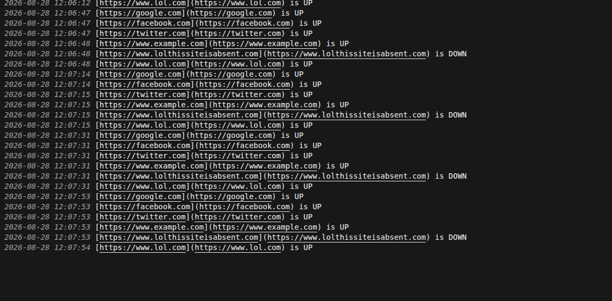
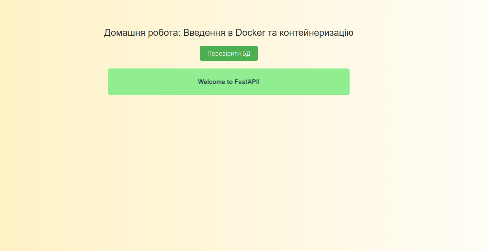

# Summary

It is a homework # 2 for GoIT Computer Systems.

## 1. Script

Script: [site-checker.sh](./site-checker.sh)

Log file:


## 2. Dockerized FAST API app

Items:
* [Dockerfile](./Dockerfile)
* [Docker compose](./docker-compose.yml)

Result:



## Prerequisites

1. [GoIT FAST API Submodule](https://github.com/mykhailo-zhar/Computer-Systems-hw02-fastapi) 
2. Linux + bash
3. Docker

## How to run

### 1. Script

```bash
./site-checker.sh
```

### 2. Dockerized FAST API app

```bash
docker compose up
```

## License

See [LICENSE](LICENSE).